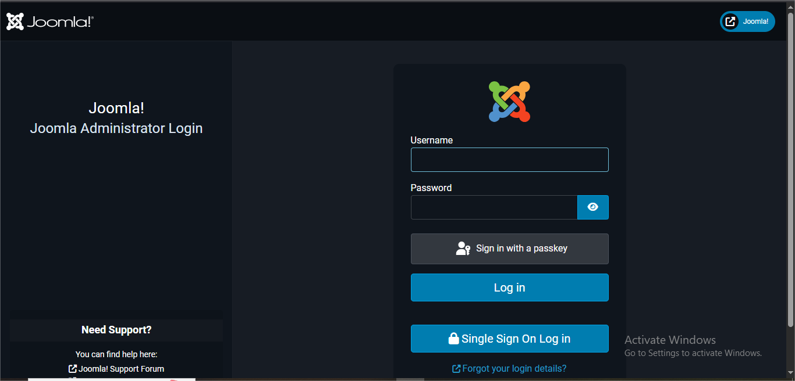
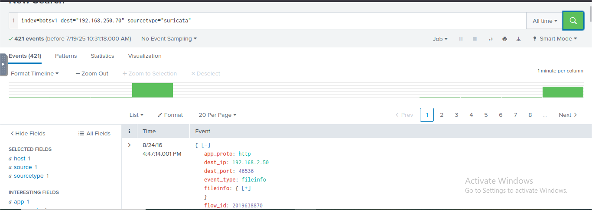
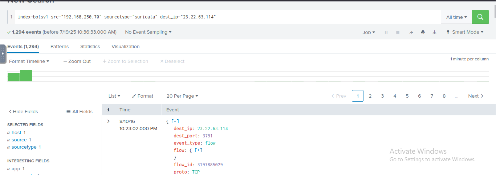

# Splunk-Incident-investigation-simulation
## Scenario Summary
This project simulates an incident where the website of Wayne Enterprises (imreallynotbatman.com) was defaced by cyber attackers. As a SOC Analyst, my role was to investigate how the attackers compromised the website and what actions they performed. Luckily Splunk was already configured using Splunk by analyzing logs stored in index "botsv1"
We followed the Cyber Kill Chain model to map each stage of the attack from reconnaissance to exploitation and beyond. When necessary, we used OSINT to fill in gaps and enrich the investigation.

Scenario: An incident where the website of Wayne Enterprises (imreallynotbatman.com) was defaced by cyber attackers.

## In Reconnaissance Phase
In this phase, the attackers are trying to collect maximum information about the server. So we need to cover some log sources covering Network traffic (we can capture all things that try to communicate with our server.
So we need to search for traces:
* SEARCH:`index=botsv1 imreallynotbatman.com`

From the source_type field, we saw that the following log sources contain the traces of this search term.

We can look at the web traffic first that's how we know what is incoming so:
* SEARCH: `index=botsv1 imreallynotbatman.com sourcetype=stream:http`
 

From src_ip field we could understand two IP created logs But the first IP creates more suspicious look at its count.

To further confirm our suspicion about the IP address 40.80.148.42, narrow down our search. We can look at the interesting fields like **User-Agent**, **Post request**  **URIs** to see what kind of traffic is coming from this particular IP.
* User-Agent

* Request

* Uri

Need to validate the IP is suspicious. If possible, it may trigger in an IDS, so let's look at Suricata logs:
 * SEARCH: `index=botsv1 imreallynotbatman.com src=40.80.148.42 sourcetype=suricata` and look field **alert.signature**.
   

So we got some answers:
 *  `Joomla` - is the CMS our web server is using (Uri field).
     
 * `Acunetix` - is the web scanner that the attacker used to perform the scanning attempts (User_agent field).

 * `192.168.250.70` - is the IP address of the server imreallynotbatman.com (check dest_ip field or in logs).
  
 * `40.80.148.42` - IP was seen attempting to scan the server. 

This information is important for attackers as well as us while investigating.

## In Exploitation Phase

For further confirm we can check the number of counts by each source_ip against our server.

Now we need to focus on our Web Server (192.168.250.70).

* SEARCH: `index=botsv1 sourcetype=stream:http dest_ip="192.168.250.70"`
  
This helps us to know about the incoming request to our server & check the **Source_ip** field.

Got 3 IP address check count and also check the **http_methods** field, we can see the methods used. suspicious level of Post-requests.

* Narrow search on Method post.
* SEARCH: `index=botsv1 sourcetype=stream:http dest_ip="192.168.250.70" http_method=POST`

 
After checking different fields, we got:
* Noticed Joomla (CMS) included in some search terms.
* Identified the admin login page of the Joomla CMS **/joomla/administrator/index.php** (search on Google).
* Suspecting a Brute-force attack because it is the admin page.

* search needed for the request sent to the login portal.
* SEARCH: `index=botsv1 imreallynotbatman.com sourcetype=stream:http dest_ip="192.168.250.70"  uri="/joomla/administrator/index.php"`
* Look at the form_data field to view requests.
  
  

  * Narrow down search to form_data because suspect attackers tried multiple credentials to gain access.
  * SEARCH: `index=botsv1 sourcetype=stream:http dest_ip="192.168.250.70" http_method=POST uri="/joomla/administrator/index.php" | table _time uri src_ip dest_ip form_data`
    
  * | table _time uri src_ip dest_ip form_data`( For table view).
    
  Look at the table, we can see that **user** & **passwd** multiple times from an `IP 23.22.63.114`, which is a  sign of a Brute-force attempt with the help of Automated tools (Look at    the attempts in such a short time).

  To show the user and pass values, we use **regex** (Regular Expressions):
  * SEARCH: `index=botsv1 sourcetype=stream:http dest_ip="192.168.250.70" http_method=POST uri="/joomla/administrator/index.php" form_data=*username*passwd* | table _time uri src_ip dest_ip form_data` 
  * Further extract passwd values only:
  * SEARCH: `index=botsv1 sourcetype=stream:http dest_ip="192.168.250.70" http_method=POST form_data=*username*passwd* | rex field=form_data "passwd=(?<creds>\w+)"  | table src_ip creds`
    

  Now check the **http_user_agent** field, which shows the attacker used a Python script to automate the Brute-force, but one request from Mozilla.
  So narrow down to **http_user_agent**.
  * SEARCH: `index=botsv1 sourcetype=stream:http dest_ip="192.168.250.70" http_method=POST form_data=*username*passwd* | rex field=form_data "passwd=(?<creds>\w+)" |table _time src_ip uri http_user_agent creds`
  
  confirmed continious Brute-force attack from **IP 23.22.63.114** and one successful login from **IP 40.80.148.42**.
  

We got some information
* `/joomla/administrator/index.php` - Url faced brute-force.
  
* `admin` - Attempt made against user.
  
* `batman` - password for admin access to CMS running  imreallynotbatman.com.
  
* `412`- Brute force attempts (1 passed).
 
* `23.22.63.114` - IP conducted brute-force.
  
* `40.80.148.42` - IP used for successful login.

## In Installation Phase

At this stage, we need to investigate whether  the attacker dropped anything on our server to maintain his access (like a backdoor).
* Look for .exe extensions
* SEARCH: `index=botsv1 sourcetype=stream:http dest_ip="192.168.250.70" *.exe`
  Look at the **part_filename{}** field and found an executable file **3791.exe** and a PHP file **agent.php**.

Now we need to check whether these files have any relation to the suspected IP addresses.
* SEARCH: `index=botsv1 sourcetype=stream:http dest_ip="192.168.250.70" "part_filename{}"="3791.exe"`
  

  Look at its **src_ip** field.
  
  Yes, we got a match

  Now, investigate whether the file was executed on the server or not.
  * SEARCH: `index=botsv1 "3791.exe"`
  

   Host-centric log source found the traces of **.exe**
  

   So we need to look into the Sysmon log and Event Id for evidence (ID =1 process creation).
* SEARCH: `index=botsv1 "3791.exe" sourcetype="XmlWinEventLog" EventCode=1`
  

  From **CommandLine** field we can understand **3791.exe** is executed on server.
  
  The evidence is also in the other logs.
  From the screen, you can collect it's MD5 hash, user executed and use search hash on VirusTotal.
  
  What we get:

 * `3791.exe`: file executed on server.
 * `AAE3F5A29935E6ABCC2C2754D12A9AF0`: md5 hash of exe file (Also view other hashes).
  
 * `NT AUTHORITY\IUSR`: User executed.
  
 * `ab.exe`: Other name of 3791.exe.
  

  ## In Action On Objective

  The attacker successfully defaced our website, So find out how it happened. We need to investigate the log sources & IP addresses communicating with the webserver.

  * Point to Suricata logs to know any detections there.
  * SEARCH: `index=botsv1 dest=192.168.250.70 sourcetype=suricata`
    
    Not detected. Now search for our server initiated communications.
    * SEARCH: `index=botsv1 src=192.168.250.70 sourcetype=suricata`
      
      
      Yes, here the suspicious IP addresses are showing that our server communicated with.

      So let's check the communication with that IP.
   * SEARCH: `index=botsv1 src=192.168.250.70 sourcetype=suricata dest_ip=23.22.63.114`
     
     
     Look for that JPEG file looks suspicious.

* SEARCH:  `index=botsv1 url="/poisonivy-is-coming-for-you-batman.jpeg" dest_ip="192.168.250.70" | table _time src dest_ip http.hostname url`
  
  That jpeg came from the attacker host **prankglassinebracket.jumpingcrab.com**.
  
 Information we collected:

  * `poisonivy-is-coming-for-you-batman.jpeg`- file defaced our website.
  * `HTTP.URI.SQL.Injection`- Detected by the **forgitate_utm** firewall on IP 40.80.148.42.
  

  ## In Command & Control Phase

  Before defacing, the attacker uploaded the file to the server. So the attacker used Dynamic Dns to resolve the malicious IP (Dynamic DNS is a service that lets attackers use a fixed domain   name (prankglassinebracket.jumpingcrab.com) that always points to their changing IP address.
  
  Let's investigate communication starting from fortigate_utm (firewall logs).
  * SEARCH:  `index=botsv1 sourcetype=fortigate_utm"poisonivy-is-coming-for-you-batman.jpeg"`
    
    Look at the fields  Source IP, destination IP, and URl.
    * Url
    
    We found the Fully Qualified Domain name.
    Let's look at the **stream:http** log to confirm.
    * SEARCH `index=botsv1 sourcetype=stream:http dest_ip=23.22.63.114 "poisonivy-is-coming-for-you-batman.jpeg" src_ip=192.168.250.70`
   Now this points to the suspicious domain as a command & control.
  
 Information we got:

* `prankglassinebracket.jumpingcrab.com` - Domain name of attacker (Dynamic domain).

## In Weaponization Phase

We have some IP and Domain associated with the attacker. To collect more information, we use OSINT Tools.

* Check jumpingcrab.com in **Robtex.com**.
  
  

* check suspicious iP 23.22.63.114 in **VirusTotal**.
  
  Found some IP addresses and domains related.
  Under the Relationship tab of VirusTotal, the domains similar to our organization (Wayne) and the attacker domain contacted  www.po1s0n1vy.com.
 
 * Check www.po1s0n1vy.com in VirusTotal and look for related domains.
   
 * check www.po1s0n1vy.com on https://whois.domaintools.com.
    

what we found:
* `IP 23.22.63.114` - IP of po1s0n1vy.
* `lillian.rose@po1s0n1vy.com` - Email associated with po1s0n1vy.

## In Delivery Phase
So far we collected some informations about adversary now with the help of Threat intelligence tools we search for related malwares.
* Search IP 23.22.63.114 in virusTotal and look under Relations tab.
  Found a suspicious name under Communicating Files and Files Referring that is 	**MirandaTateScreensaver.scr.exe**.
  
  
  The Alphanumeric in the above image is the SHA-256 of the file.
  * check **MirandaTateScreensaver.scr.exe** in **HybridAnalysis** site shows behaviour analysis of malware.
    
    With the help of Threat Intelligence sites, we  found malware associated with the adversary's IP address, which appeared to be a secondary attack vector if the initial compromise          failed.

## Findings
 * `IP 40.80.148.42` - IP was seen attempting to scan our web server.
 * `Acunetix` - A Web scanner tool that the attacker used to perform the scanning attempts.
 * `23.22.63.114` - IP conducted brute-force attack.
 * `40.80.148.42` - IP used for successful login.
 * `3791.exe`: file executed on server.
 * `poisonivy-is-coming-for-you-batman.jpeg`- file defaced our website.
 * `prankglassinebracket.jumpingcrab.com` - Domain name of attacker.
 * `lillian.rose@po1s0n1vy.com` - Email associated with suspicious IP.
 * `MirandaTateScreensaver.scr.exe` - secondary attack vector if the initial compromise failed.

## Conclusion
 This project gave me a hands-on experience in investigating a Cyber attack using Splunk as a Soc Analyst role. I got a practical experience on how attackers progress through each Cyber Kill Chain framework & learned how to:
 * Effective log analysis using a search query in SPL.
 * Understand the practical use of the Cyber Kill Chain.
 * Correlate findings with Intelligence Tools, OSINT.
 * Brute-force, Malware delivery, C2 communication — all traced.
 * Document everything in a professional & beginner-friendly format.
   
  
